# Data Heatmaps

Heatmaps saved alongside each measurement series. Generate them with:
```
cd ..
python processing/plot_all_folders_heatmap.py --plot-all
```

| Folder | Heatmap | Baseline vs RANDOM (dB) |
| --- | --- | --- |
| energy-ball-A | 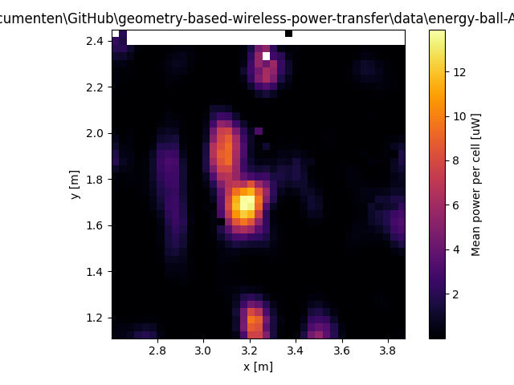 | 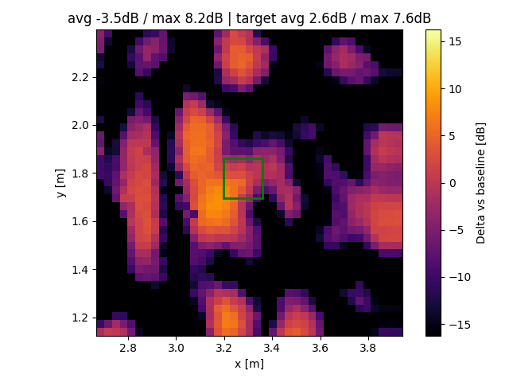 |
| RANDOM | 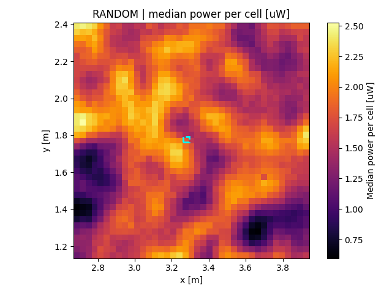 | 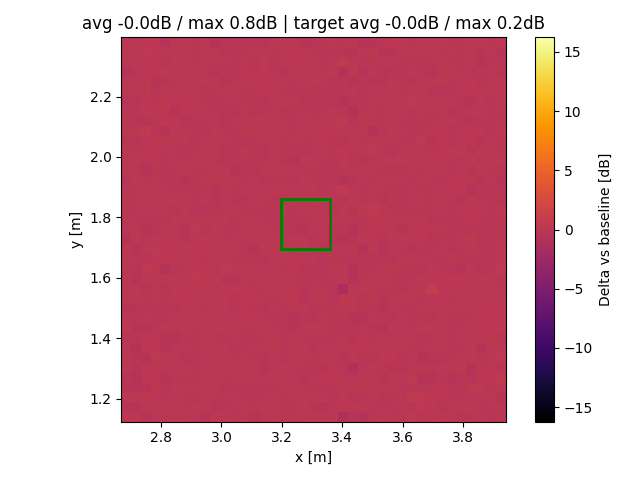 |
| sionna0 | 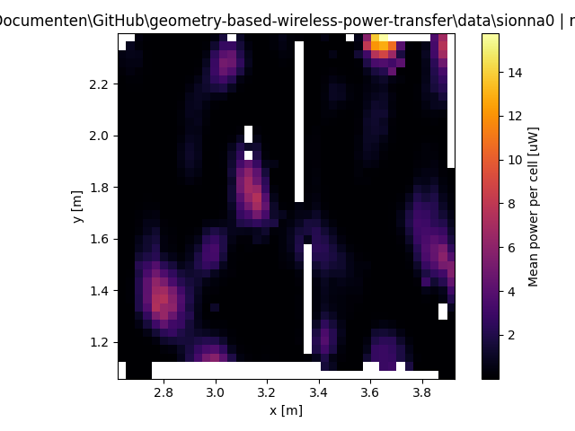 |  |
| sionna0-2-A | 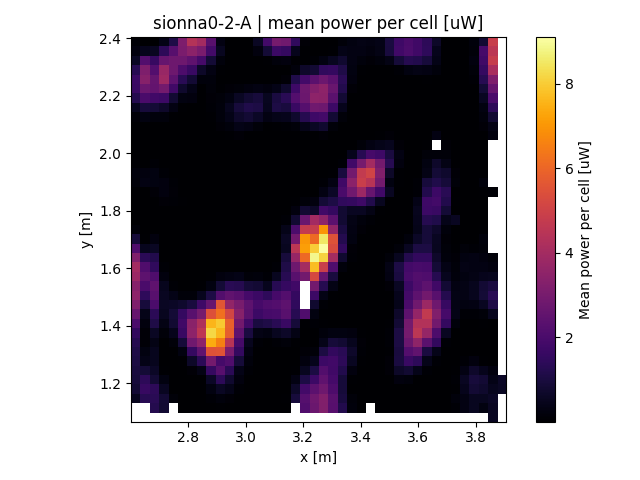 |  |
| sionna0-3-A |  |  |
| sionna1 | 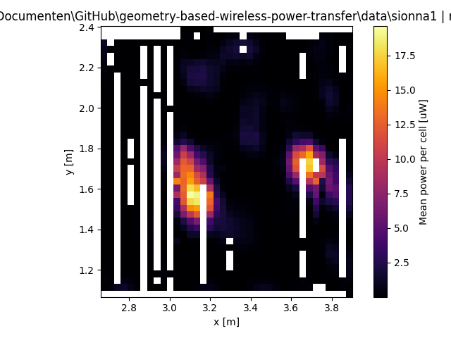 |  |
| sionna1-3-A |  |  |
| sionna1-B | 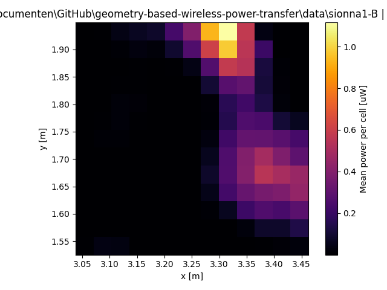 |  |
| sionna1-C | 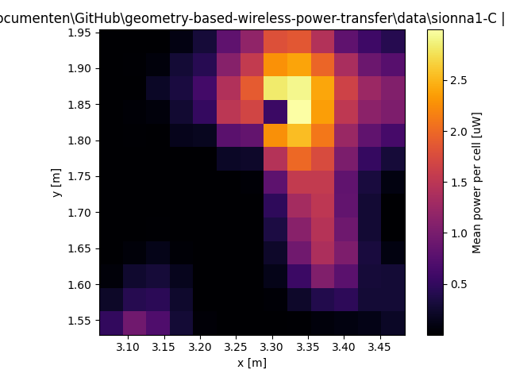 |  |
| sionna1-D | 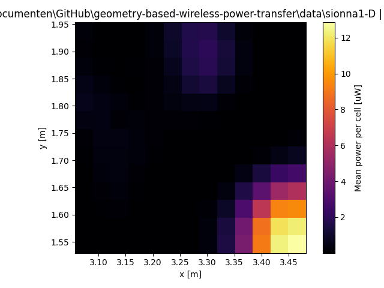 |  |
| sionna1-E | 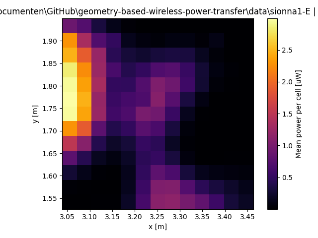 |  |
| sionna1-F | 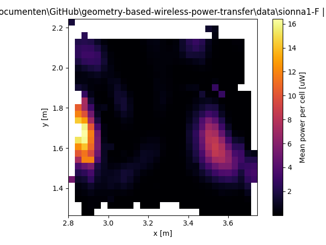 |  |
| sionna1-G | 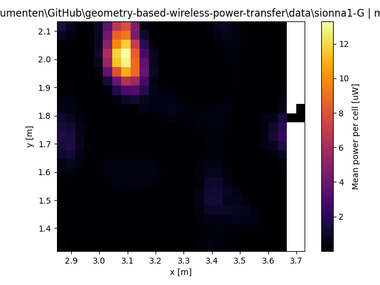 |  |
| sionna1SDR | 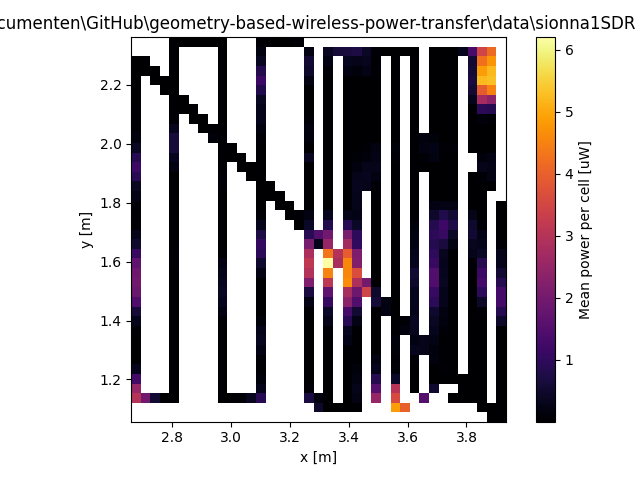 |  |
| sionna1SDR-3-A |  |  |
| sionna2 | 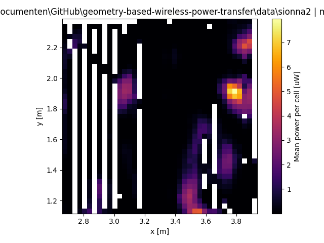 |  |
| sionna2-3-A |  |  |
| sionna2SDR | 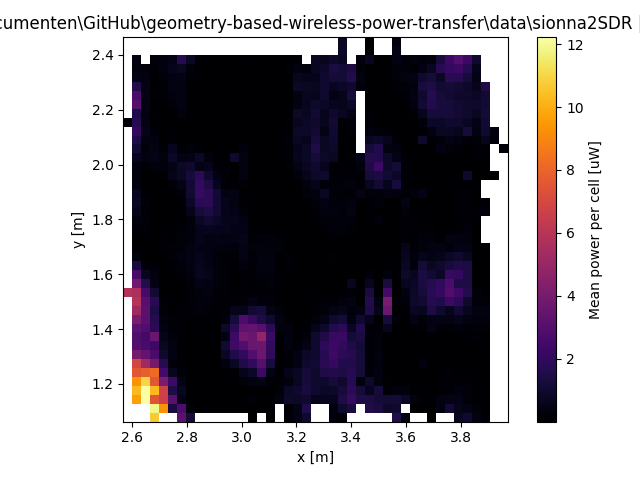 |  |
| SMC0-1 |  |  |
| SMC1-1 |  |  |
| SMC2-1 |  |  |

## Energy-ball-A results
- Iteration summary and phase plots generated from `exp-20251229125503.yml`:
  - `energy-ball-A/exp-20251229125503-1-Energy-ball_max_power_per_iteration_exp-20251229125503.yml.png`
- `energy-ball-A/exp-20251229125503-2-Power_per_iteration_(heatmap).png`
- `energy-ball-A/exp-20251229125503-3-Applied_phases_per_client.png`
- `energy-ball-A/exp-20251229125503-4-Applied_phases_(normalized_to_iteration_0).png`
- `energy-ball-A/exp-20251229125503-5-Applied_phases_(normalized_to_host_0).png`
- `energy-ball-A/exp-20251229125503-6-Applied_phases__iter0_vs_max-power_iteration.png`
- `energy-ball-A/exp-20251229125503-7-Phase_delta__max-power_iteration_vs_iter0.png`
- `energy-ball-A/exp-20251229125503-8-energy-ball-A___mean_power_per_cell_[uW].png`
